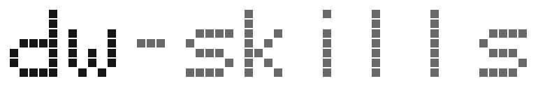

<p align="center">
  <picture>
    <source media="(prefers-color-scheme: dark)" srcset="assets/banner-dark.svg">
    <source media="(prefers-color-scheme: light)" srcset="assets/banner-light.svg">
    
  </picture>
</p>

<p align="center"><strong>spec → plan → build → verify — a persistent, technology-agnostic workflow for Claude Code that survives a <code>/clear</code>.</strong></p>

<p align="center">
  
  
  
  
  <a href="https://github.com/dominikwozniak/dw-skills/actions"></a>
</p>

Plans and reviews land on disk under `.ai/` (tracked in git), so work survives a `/clear`, a new
session, or a handoff to another agent. Every skill reads your project's own commands and
conventions — nothing about a stack is baked in.

## ◆ Why these skills exist

These aren't theoretical. Each is a failure mode I kept hitting in day-to-day work with AI agents —
the catalog is the set of reusable steps I pulled out of that loop. Each skill kills one:

- **Context dies on `/clear`, a new session, or a handoff** → plans and reviews persist as tracked
  `.ai/` files; `dw-resume` picks the work back up, `dw-handoff` packs it for the next agent.
- **The agent runs on a wrong assumption** → `dw-spec` forces the unknowns to the surface as a
  numbered Open-Questions gate and HARD STOPS until you answer.
- **"Done" is claimed but never proven** → `dw-explain` writes runnable scenarios; `dw-verify` runs
  them and never reports PASS without captured output.
- **The plan silently drifts from the code** → `dw-sync` re-aligns `PLAN.md` with what actually shipped.
- **A change merges on an eyeball, not a real pass** → `dw-review` / `dw-conform` / `dw-risk` weigh it
  across axes, against the repo's own patterns, and for blast radius.
- **Review findings have nowhere to land** → `dw-fix` applies them — the one writer in the quality
  pipeline, severity-gated (blockers first), one commit per fix.
- **The test suite bloats** → `dw-prune` trims redundant tests without dropping coverage.

The _why_ behind each design choice is in [`docs/DESIGN.md`](docs/DESIGN.md).

## ▸ Quick start

```
claude plugin marketplace add git@github.com:dominikwozniak/dw-skills.git
claude plugin install dw-planning   # spec → plan → build → resume → sync
claude plugin install dw-quality    # review · conform · fix · prune · explain · verify · risk
claude plugin install dw-misc       # bootstrap · git · handoff · doctor · setup-precommit
```

Then start a feature: `/dw-spec`. Resume after a `/clear`: `/dw-resume`.

## ↻ The workflow

> 📖 New here? [**`docs/WORKFLOWS.md`**](docs/WORKFLOWS.md) is the guided tour — the loop
> walked step by step, a recipe for each situation (start a feature, resume after a
> `/clear`, review before a PR, fix findings, reconcile drift), and the decisions between
> skills. The map below; that's the tour.

### The core loop

```
  SPEC         PLAN         BUILD                   REVIEW · VERIFY           SHIP
  /dw-spec  →  /dw-plan  →  /dw-build       →       /dw-review  /dw-explain → (open PR — your own tooling)
                          ↺ /dw-resume (pick up)    /dw-conform /dw-verify
                            /dw-sync (fix drift)    /dw-prune   /dw-risk
  └────────────── .ai/runs/<id>/ ──────────────┘    └─ .ai/verify/<branch-slug>/ ─┘
```

`<branch-slug>` = the current branch slugified, e.g. `ABC-123/password-reset` →
`abc-123-password-reset`. SHIP — deciding when to open the PR, plus the deploy/CI that follows — is
intentionally outside this toolkit (see [`docs/DESIGN.md`](docs/DESIGN.md), "Composable, not
chained").

### Acting on findings

`/dw-fix` is the one writer in the loop — it applies the `dw-review` / `dw-conform` / `dw-risk`
findings the auditors record (blockers first, one commit per fix), then you re-audit to confirm —
required after blockers, optional after a medium/low-only pass.

### Anytime

- `/dw-git` — commit / push / PR / sync / branch / stash, by your `CLAUDE.local.md` conventions.
- `/dw-handoff` — compact the session context for the next agent.

### Setup (once per repo)

- `/dw-bootstrap` — scaffold a repo for this loop (tracked `.ai/` + `.claude/`).
- `/dw-doctor` — read-only health check of the tools and hooks the loop assumes.
- `/dw-setup-precommit` — wire git-level husky + lint-staged pre-commit hooks.

A recommendation, not a rail: every skill stands alone and is invoked when you need it. They
compose through the shared `.ai/` artifacts + a "Next:" pointer at the end of each skill.

## ◇ Task router — which skill for which task

A task may match several rows — read all that apply. `⭑` = explicit-invoke only: say its name (it
never auto-fires).

| Skill                                                          | Task                                                                                                          | Say                                                         | What you get                             |
| -------------------------------------------------------------- | ------------------------------------------------------------------------------------------------------------- | ----------------------------------------------------------- | ---------------------------------------- |
| **Setup**                                                      |                                                                                                               |                                                             |                                          |
| [`dw-bootstrap`](skills/dw-bootstrap/SKILL.md) `⭑`             | Scaffold a repo for the dw-\* loop: `.ai/`, tracked settings + hooks, `CLAUDE.local.md`, gitignore            | "set up this project", "bootstrap claude"                   | tracked `.ai/` + `.claude/` scaffold     |
| [`dw-doctor`](skills/dw-doctor/SKILL.md)                       | Diagnose the env a dw-\* repo assumes — tools, hooks, `.ai/` sanity; report fixes (read-only)                 | "check my setup", "why aren't my hooks running"             | read-only health report + fixes          |
| [`dw-setup-precommit`](skills/dw-setup-precommit/SKILL.md) `⭑` | Wire git-level pre-commit hooks (husky + lint-staged) for a pnpm node/ts/js repo — format + lint staged files | "set up pre-commit", "add husky", "configure lint-staged"   | tracked `.husky/` + `.lintstagedrc.json` |
| **Spec & plan**                                                |                                                                                                               |                                                             |                                          |
| [`dw-spec`](skills/dw-spec/SKILL.md)                           | Start a feature; surface unknowns via an open-questions gate                                                  | "spec this out", "write a spec"                             | `SPEC.md` under `.ai/runs/`              |
| [`dw-resume`](skills/dw-resume/SKILL.md)                       | Pick up after a `/clear`; find the first not-done step                                                        | "where were we", "resume"                                   | read-only status report                  |
| [`dw-plan`](skills/dw-plan/SKILL.md)                           | Turn a ready spec into thin vertical slices                                                                   | "plan this", "break this into tasks"                        | `PLAN.md` status table                   |
| **Build**                                                      |                                                                                                               |                                                             |                                          |
| [`dw-build`](skills/dw-build/SKILL.md)                         | Build the next slice: RED → GREEN → regression → commit                                                       | "build the next step", "implement the plan"                 | code + `done` row + SHA                  |
| [`dw-sync`](skills/dw-sync/SKILL.md) `⭑`                       | Re-align the plan with the code after drift                                                                   | "sync the plan", "reconcile plan with commits"              | reconciled `PLAN.md` (consent-gated)     |
| **Review & verify**                                            |                                                                                                               |                                                             |                                          |
| [`dw-review`](skills/dw-review/SKILL.md)                       | Multi-axis review of a diff (correctness/security/perf/…)                                                     | "review my PR", "code review"                               | `review.md` + verdict                    |
| [`dw-conform`](skills/dw-conform/SKILL.md)                     | Check a change against the repo's existing patterns                                                           | "does this match our patterns", "check for drift"           | `conform.md` drift report                |
| [`dw-fix`](skills/dw-fix/SKILL.md)                             | Apply review / conform / risk findings — severity-ordered, one commit per fix                                 | "fix the findings", "address the review", "apply the fixes" | code commits + `fix.md`                  |
| [`dw-explain`](skills/dw-explain/SKILL.md)                     | Explain a change + generate runnable verification scenarios                                                   | "explain this change", "how do I prove this works"          | `explain.md` scenarios                   |
| [`dw-verify`](skills/dw-verify/SKILL.md)                       | Run those scenarios and record PASS/FAIL + evidence                                                           | "verify this change", "prove the fix works"                 | `verify-run.md`                          |
| [`dw-risk`](skills/dw-risk/SKILL.md)                           | Assess blast radius, out-of-code impact, rollback                                                             | "what's the blast radius", "is this migration safe"         | `risk.md`                                |
| [`dw-prune`](skills/dw-prune/SKILL.md) `⭑`                     | Trim redundant tests without dropping coverage                                                                | "prune tests", "remove redundant tests"                     | keep/merge/delete plan (consent-gated)   |
| **Git**                                                        |                                                                                                               |                                                             |                                          |
| [`dw-git`](skills/dw-git/SKILL.md)                             | All git ops — commit / push / PR / sync / branch / stash, by your conventions                                 | "commit", "push", "open PR", "sync with main"               | commits / PR per `CLAUDE.local.md`       |
| **Handoff**                                                    |                                                                                                               |                                                             |                                          |
| [`dw-handoff`](skills/dw-handoff/SKILL.md) `⭑`                 | Compact the session for the next agent                                                                        | "session handoff", "handoff"                                | `.ai/handoffs/<ts>.md`                   |

Within Review & verify: `dw-explain → dw-verify` is a chain (verify runs explain's scenarios);
`dw-review` and `dw-conform` are independent axes; `dw-prune` trims redundant tests on explicit
consent; `dw-risk` reads whatever neighbours exist and closes the pipeline. `dw-fix` is the one
writer — it applies the findings the auditors record (blockers first), then you re-audit to confirm
(required after blockers, optional after a medium/low-only pass).

## ▣ Plugins — install what you need (3)

Three plugins, grouped by job. The [task router](#-task-router--which-skill-for-which-task) above says
what each skill does — here's which plugin ships it and where its artifacts land.

- **`dw-planning`** — the spec→plan→build loop. `dw-spec` · `dw-resume` · `dw-plan` · `dw-build` ·
  `dw-sync`. Artifacts: `.ai/runs/<id>/`.
- **`dw-quality`** — the change-quality pipeline. `dw-review` · `dw-conform` · `dw-fix` · `dw-prune` ·
  `dw-explain` · `dw-verify` · `dw-risk`. The auditors diagnose (read-only); `dw-fix` is the one
  writer. Artifacts: `.ai/verify/<branch-slug>/`.
- **`dw-misc`** — repo setup + everyday helpers. `dw-bootstrap` · `dw-git` · `dw-handoff` ·
  `dw-doctor` · `dw-setup-precommit`.

<details>
<summary><strong>⚙ How it works — the design in one screen</strong></summary>

- **Persistence in the skill, not a wrapper.** Each `SKILL.md` writes its own `.ai/` paths as part of
  its procedure, so plans land automatically and travel with the installed plugin — no
  `.claude/commands/` glue layer. (Stack commands are read from your project too — nothing is
  hardcoded; that's the opening pitch up top.)
- **`.ai/` is tracked, one folder per task, no central index.** Artifacts are real work docs
  committed with the code; each run is matched to its git branch, so branches never fight over one file.
- **Thin harness, fat skills.** The process lives in the markdown, not in glue code — so every model
  upgrade improves the skills for free. Bulky detail (templates, examples) loads on demand from
  `references/`. (Inspired by ["Fat Skills"](https://x.com/garrytan/status/2042925773300908103).)
- **Composable, not chained.** Skills stay separate and link through shared `.ai/` artifacts + a
  "Next:" pointer — a recommendation, never a forced sequence. Why there's no autonomous loop closing
  this is in [`docs/DESIGN.md`](docs/DESIGN.md), "Loops vs persistence."
- **Explicit-only skills** (`dw-bootstrap`, `dw-handoff`, `dw-prune`, `dw-sync`, `dw-setup-precommit`)
  are invoked by name and never auto-trigger; the rest can be model-invoked when the task fits.

Full design rationale — the _why_ behind each choice — lives in [`docs/DESIGN.md`](docs/DESIGN.md).

</details>

<details>
<summary><strong>▤ Project structure</strong></summary>

```
skills/<name>/SKILL.md          canonical skill (edit here)
plugins/<collection>/           plugin.json + git-tracked symlinks → ../../../skills/<name>
.claude-plugin/marketplace.json makes the repo installable
docs/WORKFLOWS.md               the guided tour (the "how" — recipes + decisions)
docs/DESIGN.md                  design rationale (the "why")
docs/SKILL-ANATOMY.md           the shape every SKILL.md follows
```

</details>

<details>
<summary><strong>◈ Contributing</strong></summary>

Layout, conventions, the add-a-skill checklist, and CI all live in [`AGENTS.md`](AGENTS.md)
(`CLAUDE.md` is a symlink to it).

</details>

## ▪ License

MIT
